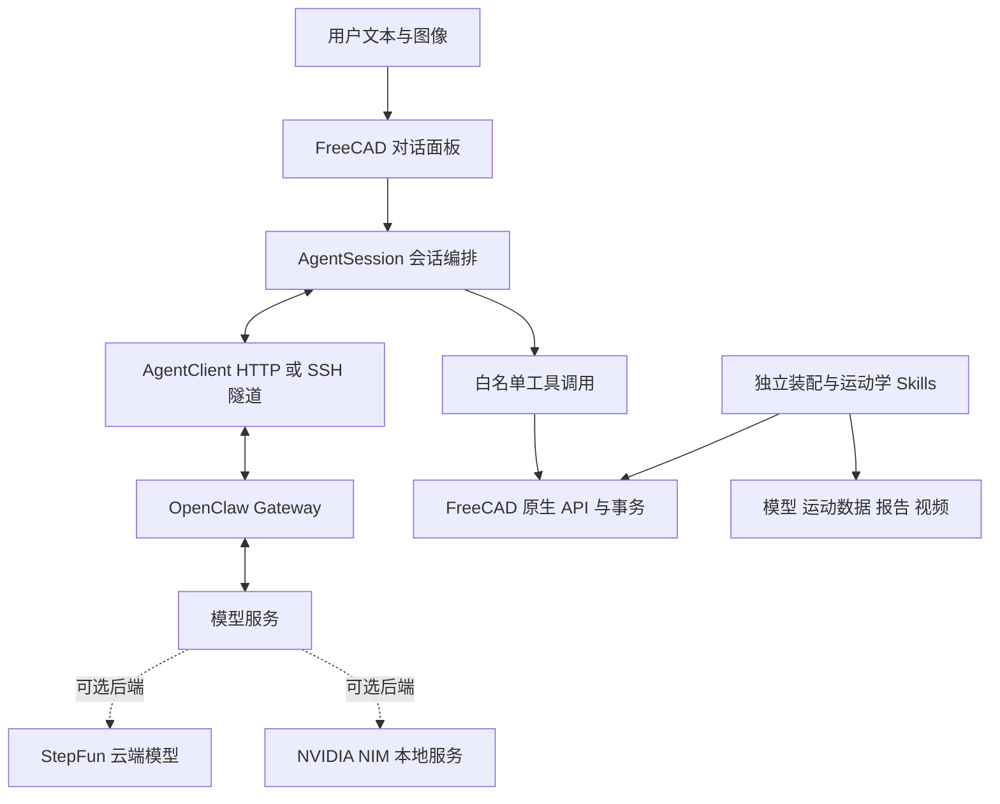

# KineSketch

KineSketch 是集成在 FreeCAD 中的智能建模助手。用户通过对话面板描述需求，智能体读取当前文档、调用工具并生成参数化 3D 模型。项目还提供装配与运动学 Skills，用于曲柄滑块机构的装配、运动仿真和结果导出。

- **版本**：0.1.0
- **开源地址**：[LiZhang6/KineSketch](https://github.com/LiZhang6/KineSketch)
- **运行环境**：FreeCAD 1.0+、Python 3.10+；SSH 连接需要系统 OpenSSH 客户端
- **许可证**：代码采用 [LGPL-2.1-or-later](LICENSE-Code)，资源采用 [CC-BY-SA-4.0](LICENSE-Assets)

## 核心功能

- **自然语言建模**：创建参数化长方体、圆柱体，调整对象位置与姿态，以及适配视图。几何操作使用 FreeCAD 事务，异常时回滚，完成后可通过 Undo 撤销。
- **图文交互**：支持文字和 PNG、JPEG、WebP 图片输入，单张图片上限为 10 MiB；图像理解需要模型支持视觉输入。
- **流式对话与停止**：网络请求在后台线程运行，界面批量刷新回复。点击 `Stop` 可中断连接并丢弃未执行动作，已完成的 CAD 修改保留。
- **机构装配与仿真**：通过两个独立 Skills 校验零件、建立原生装配、采样运动数据，并输出模型、曲线、报告及真实视口视频。
- **可替换模型后端**：通过 OpenAI 兼容接口连接 OpenClaw Gateway，由网关管理会话、模型选择和供应商凭据。

## 架构与技术实现



一次建模请求分为四步：

1. **读取上下文**：采集活动文档、对象名称、类型及当前选择，与用户请求一起发送给模型。
2. **生成工具调用**：模型返回文本或结构化 `tool_calls`，工具定义用 JSON Schema 描述参数。
3. **执行 CAD 操作**：客户端检查工具名和参数，在 GUI 线程调用 FreeCAD API，并返回执行结果。
4. **反馈结果**：工具结果回传模型，模型据此答复；每轮最多六次工具往返。

`AgentClient` 使用 Python 标准库处理 HTTP、HTTPS 和流式响应，支持系统 OpenSSH 端口转发。`AgentSession` 管理消息与工具结果，系统提示统一毫米和度的单位约定，并要求依据工具结果确认操作是否完成。

执行端只开放白名单工具，不执行模型生成的任意 Python。访问令牌仅保留在当前面板内存，SSH 使用密钥认证和严格主机密钥检查。`Stop` 不保证服务端推理立即终止；`Clear` 清除本地会话，不删除远端已保留的数据。

## Agent Skills

两个 Skills 通过 `mechanism.json` 交接数据，使用命名接口与 SHA-256 校验绑定零件和装配文件。

### 装配

[`assembly/SKILL.md`](freecad/KineSketch/skills/assembly/SKILL.md) 接收 `ground`、`crank`、`connecting_rod`、`slider` 四个 FCStd 零件及 `parts_manifest.json`。脚本校验文件、单位和接口坐标系，固定机架，建立三个转动副和一个移动副，再调用原生求解器检查关节残差。

输出包括 `assembly.FCStd`、`mechanism.json` 和装配报告。只有装配验证通过，才可进入运动学阶段。

### 运动学

[`kinematic/SKILL.md`](freecad/KineSketch/skills/kinematic/SKILL.md) 在 FreeCAD GUI Python 进程中运行，以恒定正转速驱动 `ground_crank`，采样原生求解器的滑块位置，计算位移、速度和加速度，并用独立解析式校核结果。

输出包括 `simulation.FCStd`、`motion.csv`、`motion.svg`、运行配置和仿真报告。可选视频由 FreeCAD 真实视口 PNG 帧经 FFmpeg 编码为 H.264 MP4。

新增 Skill 应提供适用范围、输入契约、执行入口和结构化结果，沿用 `success`、`missing_input`、`blocked`、`failed` 状态，并为每次运行创建独立输出目录。详细接口与示例见[装配和运动学集成指南](docs/zhang_assembly_kinematic.md)。

## 部署

### FreeCAD 客户端

1. 安装 FreeCAD, 将本项目直接拷贝到下述路径即可使用
   ```
   C:\Users\<你的用户名>\AppData\Roaming\FreeCAD\<FreeMod版本号>\Mod
   ```
2. 进入 **KineSketch** 工作台，点击 **Open Agent**。
3. 填写 `Endpoint`、`Agent` 和 `Access token`。Endpoint 以 `/v1` 结尾，或直接指向 `/chat/completions`。
4. 本项目使用 SSH 隧道连接网关。先配置密钥认证，再在面板中填写服务器地址、端口和用户名。

在提供 `ssh-copy-id` 的终端中执行以下命令，将用户名和主机地址替换为实际值；非默认端口需给连接和公钥安装命令增加 `-p <port>`：

```bash
ssh-keygen -t rsa
ssh-copy-id -i ~/.ssh/id_rsa.pub <username>@<host>
```

Windows 自带 OpenSSH 通常不包含 `ssh-copy-id`，可将公钥交由服务器管理员安装。验证登录成功后，在面板中配置网关：

```text
Endpoint: http://127.0.0.1:18789/v1
Agent:    openclaw/default
Token:    网关访问令牌
```

使用 SSH 时，Endpoint 中的回环地址指向远端服务器上的网关。网关需启用 Chat Completions 端点；底层模型和供应商密钥在网关侧配置。Windows 用户可运行 `build.ps1` 生成 wheel 与源码包。

### 本地算力与模型服务

本地部署可将 OpenClaw Gateway 和 NVIDIA 推理服务运行在同一台 GPU 工作站，客户端通过回环地址或 SSH 隧道访问。[NVIDIA NIM](https://docs.nvidia.com/nim/large-language-models/latest/reference/api-reference.html) 提供兼容推理接口，[TensorRT-LLM](https://docs.nvidia.com/tensorrt-llm/) 可用于受支持模型的 GPU 推理优化；具体配置需匹配 GPU、模型和后端版本。

云端方案可通过网关连接[阶跃星辰开放平台](https://platform.stepfun.com/)，也可在网关侧配置本地与云端模型路由。部署完成后，应验证流式输出、工具调用、多轮会话和图像输入，并记录真实模型 ID、GPU 型号与请求耗时。

NVIDIA NIM、TensorRT-LLM 目前属于可选部署方案，仓库未直接依赖这些 SDK；StepFun 模型由网关选择，仓库未固定具体型号。

## 优化方案

- **提示词与工具**：固定单位，使用精简文档摘要和明确的工具参数。当前温度为 0.2，工具结果回传后再生成答复，减少错误参数和无依据的完成声明。
- **上下文与响应**：限制历史长度和工具轮数，流式内容批量刷新；复杂机构任务由 Skill 契约承载，减少重复描述。
- **本地推理**：按硬件与模型支持情况选择 NIM 配置，评估上下文长度、最大输出 token、缓存和并发策略。重点衡量首 token 延迟、JSON 合法率、显存占用及完整请求耗时。
- **模型选择**：用同一组中文建模、尺寸理解、对象引用和图像任务比较 StepFun 与本地模型，根据工具调用成功率、延迟和成本选择后端。

## 技术栈

| 技术 | 用途 |
| --- | --- |
| FreeCAD Part、Assembly | 参数化几何、装配求解和视图 |
| Python、PySide / Qt | 插件逻辑、对话面板和线程调度 |
| OpenAI 兼容 Chat Completions | 消息、图像、流式响应和工具调用 |
| OpenClaw Gateway、OpenSSH | 模型接入、会话管理和隧道连接 |
| `SKILL.md`、JSON 契约、Python 脚本 | 装配与运动学流程 |
| FreeCAD `saveImage`、FFmpeg | 视口捕获与视频编码 |
| Hatchling、Pixi、unittest | 构建、环境管理和测试 |
| NVIDIA NIM、TensorRT-LLM（可选） | 本地模型服务和推理优化 |
| StepFun 模型（可选） | 网关侧云端推理服务 |

## 当前范围与后续计划

对话面板目前提供基础实体、位置姿态和视图工具，装配与运动学 Skills 通过独立入口运行。机构仿真仅支持零偏置、正分支、连杆长度大于曲柄半径的平面曲柄滑块，不包含受力、碰撞或柔性体计算。

后续计划将两个 Skills 接入对话工具层，并扩展参数化草图、布尔建模和工程图能力。发布前需完成客户端交互、原生装配与仿真验证，保留运行报告及脱敏模型配置，并通过开源仓库链接提交项目。

## 致谢

感谢赛事主办方为参赛团队提供的资源与支持，为 KineSketch 的开发、验证和展示创造了条件。感谢 FreeCAD、OpenClaw 及相关开源项目的开发者和社区贡献者，他们提供的工具、文档与实践经验是本项目的重要基础。同时感谢在项目设计、测试与交流过程中提出建议的伙伴。
